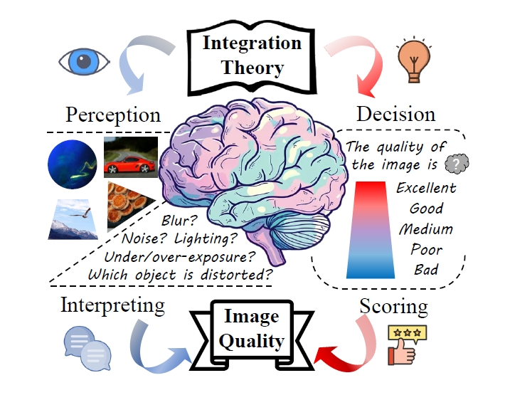

  <h1>Teaching LMMs for Image Quality Scoring and Interpreting</h1> 

Model Weights Available at [Q-SiT](https://huggingface.co/zhangzicheng/q-sit) [Q-SiT-mini](https://huggingface.co/zhangzicheng/q-sit-mini)

      

 

## Motivation

      

 
The Perception-Decision Integration Model for image quality scoring and interpreting tasks recognizes that these two processes are deeply interconnected. While most previous approaches treat them separately with distinct models, interpreting (the perceptual process) and scoring (the decisionmaking process) are not independent from the human vision system (HVS). Instead, they are integral components of a unified evaluation framework.

## Performance

## Citation

To do
