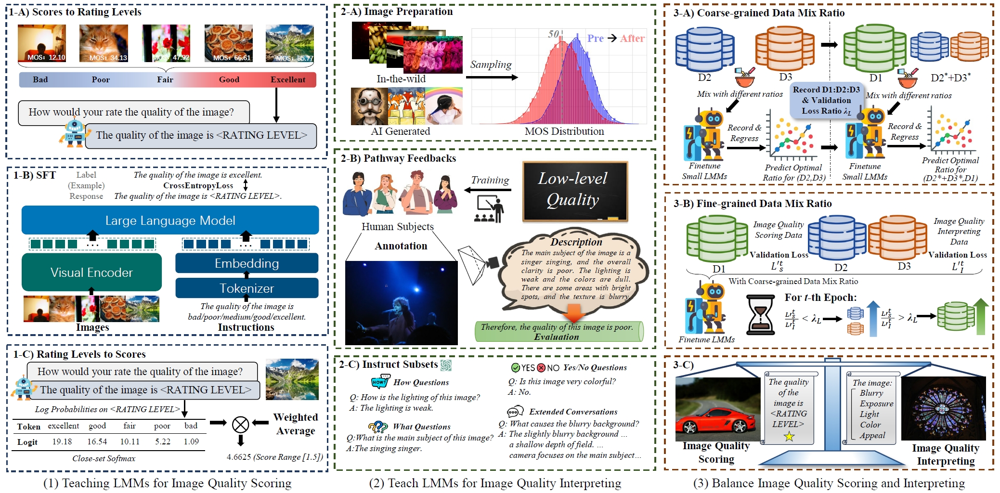
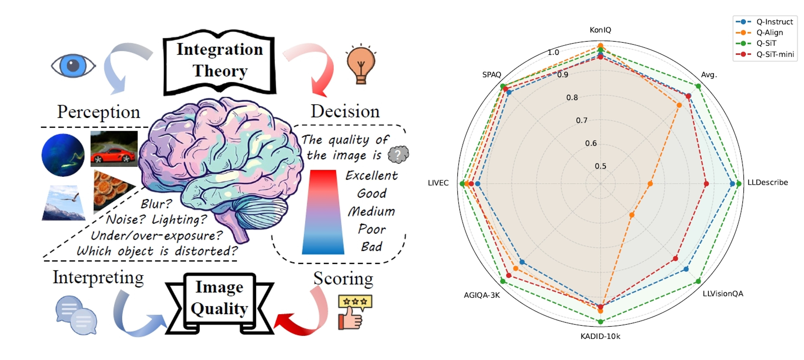
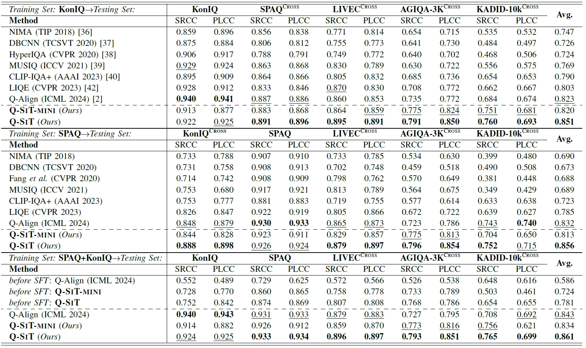
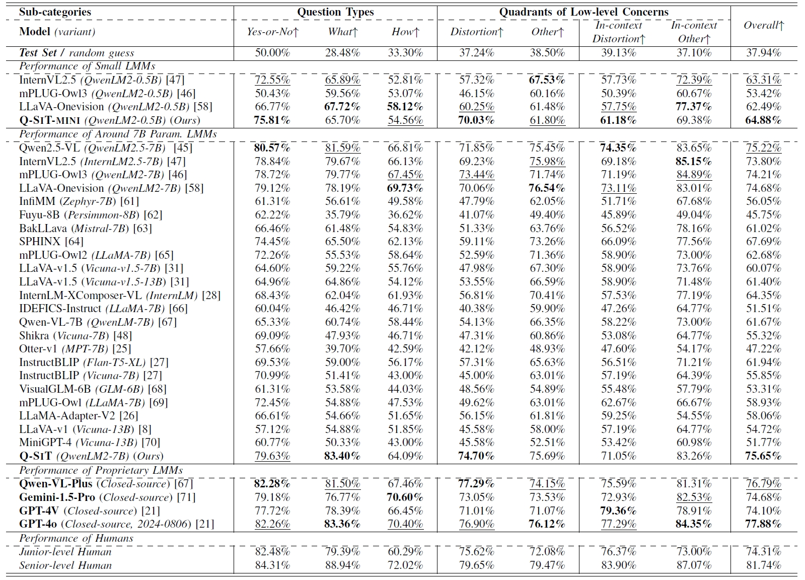

<div align="center">
  <h1>Teaching LMMs for Image Quality Scoring and Interpreting</h1> 

  <div>
      <a href="https://zzc-1998.github.io/" target="_blank">Zicheng Zhang</a><sup>1</sup>,
      <a href="https://teowu.github.io/" target="_blank">Haoning Wu</a><sup>2</sup>,
      <a href="" target="_blank">Ziheng Jia</a><sup>1</sup>,
      <a href="https://personal.ntu.edu.sg/wslin/Home.html" target="_blank">Weisi Lin</a><sup>2</sup>,
      <a href="https://ee.sjtu.edu.cn/en/FacultyDetail.aspx?id=24&infoid=153&flag=153" target="_blank">Guangtao Zhai</a><sup>1</sup>
  </div>
  <div>
  <sup>1</sup>Shanghai Jiao Tong University, <sup>2</sup>Nanyang Technological University
</div>   

Paper Available at [Arxiv](https://arxiv.org/abs/2503.09197).

Model Weights Available at [Q-SiT](https://huggingface.co/zhangzicheng/q-sit) [Q-SiT-mini](https://huggingface.co/zhangzicheng/q-sit-mini)

<div style="width: 100%; text-align: center; margin:auto;">
      
</div> 


## Motivation & Performance Quick Look
<div style="width: 100%; text-align: center; margin:auto;">
      
</div> 

The Perception-Decision Integration Model for image quality scoring and interpreting tasks recognizes that these two processes are deeply interconnected. While most previous approaches treat them separately with distinct models, interpreting (the perceptual process) and scoring (the decisionmaking process) are not independent from the human vision system (HVS). Instead, they are integral components of a unified evaluation framework.

<h2>Scoring Performance</h2> 
<div style="width: 80%; text-align: center; margin:auto;">
      
</div> 

<h2>Interpreting Performance</h2> 
<div style="width: 80%; text-align: center; margin:auto;">
      
</div> 


<div align="left">
<h2>[Installation Free!] Quicker Start with Hugging Face AutoModel</h2> 

No need to install this GitHub repo. Ensure that you use the Transformers package of 4.45.0 (`pip install transformers==4.45.0`).

Do the image quality interpreting chat with q-sit.
```python
import requests
from PIL import Image
import torch
from transformers import AutoProcessor, LlavaOnevisionForConditionalGeneration

model_id = "zhangzicheng/q-sit-mini"
# if you want to use primary version, switch to q-sit
# model_id = "zhangzicheng/q-sit"

model = LlavaOnevisionForConditionalGeneration.from_pretrained(
    model_id,
    torch_dtype=torch.float16,
    low_cpu_mem_usage=True,
).to(0)

processor = AutoProcessor.from_pretrained(model_id)


conversation = [
    {
        "role": "user",
        "content": [
            {"type": "text", "text": "How is the clarity of the human in this image?"},
            {"type": "image"},
        ],
    },
]
prompt = processor.apply_chat_template(conversation, add_generation_prompt=True)

raw_image = Image.open(requests.get("https://github.com/Q-Future/Q-SiT/blob/main/44009500.jpg?raw=true",stream=True).raw)

inputs = processor(images=raw_image, text=prompt, return_tensors='pt').to(0, torch.float16)

output = model.generate(**inputs, max_new_tokens=200, do_sample=False)
print(processor.decode(output[0][2:], skip_special_tokens=True).split("assistant")[-1])
# very low
```

Do the image quality scoring with q-sit.
```python
import torch
import requests
from PIL import Image
from transformers import AutoProcessor, LlavaOnevisionForConditionalGeneration, AutoTokenizer
import numpy as np

def wa5(logits):
    logprobs = np.array([logits["Excellent"], logits["Good"], logits["Fair"], logits["Poor"], logits["Bad"]])
    probs = np.exp(logprobs) / np.sum(np.exp(logprobs))
    return np.inner(probs, np.array([1, 0.75, 0.5, 0.25, 0]))

model_id = "zhangzicheng/q-sit-mini"
model = LlavaOnevisionForConditionalGeneration.from_pretrained(
    model_id,
    torch_dtype=torch.float16,
    low_cpu_mem_usage=True,
).to(0)

processor = AutoProcessor.from_pretrained(model_id)
tokenizer = AutoTokenizer.from_pretrained(model_id)

# Define rating tokens
toks = ["Excellent", "Good", "Fair", "Poor", "Bad"]
ids_ = [id_[0] for id_ in tokenizer(toks)["input_ids"]]
print("Rating token IDs:", ids_)

conversation = [
    {
        "role": "user",
        "content": [
            {"type": "text", "text": "Assume you are an image quality evaluator. \nYour rating should be chosen from the following five categories: Excellent, Good, Fair, Poor, and Bad (from high to low). \nHow would you rate the quality of this image?"},
            {"type": "image"},
        ],
    },
]
prompt = processor.apply_chat_template(conversation, add_generation_prompt=True)

# Load image
raw_image = Image.open(requests.get("https://github.com/Q-Future/Q-SiT/blob/main/44009500.jpg?raw=true",stream=True).raw)
inputs = processor(images=raw_image, text=prompt, return_tensors='pt').to(0, torch.float16)

# Manually append the assistant prefix "The quality of this image is "
prefix_text = "The quality of this image is "
prefix_ids = tokenizer(prefix_text, return_tensors="pt")["input_ids"].to(0)
inputs["input_ids"] = torch.cat([inputs["input_ids"], prefix_ids], dim=-1)
inputs["attention_mask"] = torch.ones_like(inputs["input_ids"])  # Update attention mask

# Generate exactly one token (the rating)
output = model.generate(
    **inputs,
    max_new_tokens=1,  # Generate only the rating token
    output_logits=True,
    return_dict_in_generate=True,
)

# Extract logits for the generated rating token
last_logits = output.logits[-1][0]  # Shape: [vocab_size]
logits_dict = {tok: last_logits[id_].item() for tok, id_ in zip(toks, ids_)}
weighted_score = wa5(logits_dict)
print("Weighted average score:", weighted_score)
# Weighted average score: 0.045549712192942585  range from 0-1
# if you want range from 0-5, multiply 5
```

To test q-sit on datasets, please refer to evaluation scripts [here](https://github.com/Q-Future/Q-SiT/tree/main/eval_scripts).


<h2>Training Q-SiT</h2>

The q-sit is based on the llava-onevision-0.5b and llava-onevision-7b. Set up the training environment from the official [llava site](https://github.com/LLaVA-VL/LLaVA-NeXT).

Prepare the images of [Koniq/SPAQ/Q-Instruct](https://huggingface.co/datasets/q-future/Q-Instruct-DB/blob/main/q-instruct-images.tar), and [llava-150K](https://huggingface.co/datasets/liuhaotian/LLaVA-Instruct-150K) datasets.

Get the cleaned training jsons from [here](https://github.com/Q-Future/Q-SiT/tree/main/training_jsons).

Modify the [finetune_ov.sh](https://github.com/LLaVA-VL/LLaVA-NeXT/blob/main/scripts/train/finetune_ov.sh) with the provided [single_image.yaml](https://github.com/Q-Future/Q-SiT/blob/main/training_jsons/single_image.yaml). And you can begin training!

It's worth noting that the llava ov weights are not compatible with the transformers package. You might want to convert your weight to the hf versions [here](https://github.com/huggingface/transformers/blob/main/src/transformers/models/llava_onevision/convert_llava_onevision_weights_to_hf.py).


## Citation

If you find our work useful, please cite our paper as:
```
@misc{zhang2025teachinglmmsimagequality,
      title={Teaching LMMs for Image Quality Scoring and Interpreting}, 
      author={Zicheng Zhang and Haoning Wu and Ziheng Jia and Weisi Lin and Guangtao Zhai},
      year={2025},
      eprint={2503.09197},
      archivePrefix={arXiv},
      primaryClass={cs.CV},
      url={https://arxiv.org/abs/2503.09197}, 
}
```

</div> 
